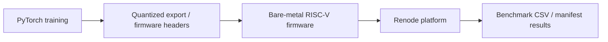
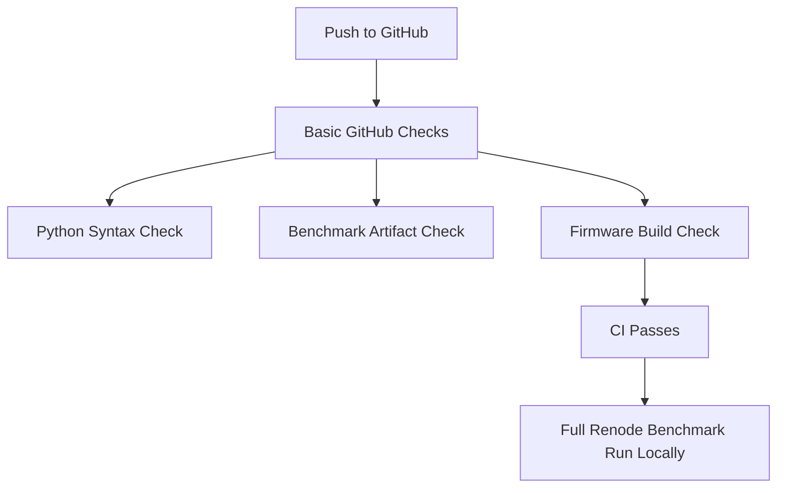

# RISC-V Edge AI Cat/Dog Classifier

> **Simulation scope:** This project reports Renode simulation / Renode-modeled results only. No physical FPGA hardware measurements are reported unless separately verified.

This project trains a small PyTorch CNN for CIFAR-10 cat/dog classification, exports quantized firmware headers, and evaluates a bare-metal RISC-V inference flow in Renode.

## Architecture



## Repository Layout

- `train_catdog.py` trains `TinyCatDogNet` and exports Q8.8 firmware weight/LUT headers.
- `firmware/` contains the bare-metal RISC-V inference code and linker script.
- `renode/` contains the Renode platform and run scripts.
- `scripts/` contains dataset export, Renode benchmark, and artifact verification tools.
- `results/` contains Renode simulation benchmark artifacts from previous runs.
- `best_catdog.pth` is a saved PyTorch model checkpoint.

The local `venv/` and downloaded `data/` directory are not included because they can be recreated.

## Requirements

- Python 3.10 or newer
- Python packages in `requirements.txt`
- RISC-V bare-metal GCC toolchain, such as `riscv32-unknown-elf-gcc`
- Renode, for simulation runs

## Quick Start From Fresh Clone

```bash
git clone https://github.com/riscv-edge-ai/catdog-riscv-edge-ai.git
cd catdog-riscv-edge-ai
python3 -m venv venv
source venv/bin/activate
pip install -r requirements.txt
python -m py_compile train_catdog.py scripts/*.py
```

Build the firmware after installing a compatible RISC-V toolchain:

```bash
make -C firmware
```

Prepare a small local dataset export after CIFAR-10 has been downloaded by the training script or placed under `data/`:

```bash
python scripts/export_eval_dataset.py --count 10
```

Run one small Renode simulation after installing Renode and the RISC-V toolchain:

```bash
python scripts/run_renode_full_uart.py --dataset-count 10 --dataset-offset 0 --macs-per-cycle 4 --timeout 1200
```

Verify the checked-in benchmark artifacts:

```bash
python scripts/verify_benchmark_consistency.py
```

Regenerate packaged benchmark artifacts after local CIFAR-10 data is available:

```bash
python scripts/build_chunked_submission_artifacts.py
```

The full local benchmark wrapper is:

```bash
./run_benchmark.sh
```

Note: the full wrapper requires Renode, the RISC-V toolchain, and local CIFAR-10 data. It can take a long time.

## Basic Checks and Local Verification

GitHub Actions runs only basic checks for this repository. It checks Python syntax, verifies the packaged benchmark artifacts, and builds the firmware with a RISC-V GCC toolchain.

The CI workflow does not reproduce the full Renode benchmark. Full benchmark verification should be done locally with Renode installed.

The canonical packaged benchmark files are:

- `results/benchmark_500.csv`
- `results/benchmark_500_manifest.json`



## Train the CNN

Run a quick smoke test:

```bash
python train_catdog.py --epochs 1
```

Run the full training flow:

```bash
python train_catdog.py --epochs 100
```

Training downloads CIFAR-10 into `data/`, filters it to cats and dogs, saves `best_catdog.pth`, and regenerates:

- `firmware/include/weights.h`
- `firmware/lut/relu_lut.h`
- `firmware/lut/sigmoid_lut.h`

## Benchmark Results

These are Renode simulation / Renode-modeled results only. They are not physical FPGA hardware measurements.

The canonical packaged 500-image benchmark is aggregated from three preserved Renode UART logs, described in `results/benchmark_500_manifest.json` and `results/BENCHMARK_ARTIFACTS.md`.

| Metric | Value | Source |
| --- | ---: | --- |
| Dataset count | 500 images | `results/benchmark_500_manifest.json` (`row_count`) |
| Renode-modeled Q8.8 accelerator accuracy | 73.600% | `results/table1_accuracy_500.csv` |
| Renode-modeled software-only accuracy | 73.600% | `results/table1_accuracy_500.csv` |
| Float reference accuracy | 73.600% | `results/float_reference_accuracy.csv` |
| Average Renode-modeled accelerator cycles | 212862.602 | `results/benchmark_500_manifest.json` |
| Average Renode software-only cycles | 2895686.372 | `results/benchmark_500_manifest.json` |
| Speedup, software cycles / accelerator cycles | 13.603547x | computed from `results/benchmark_500.csv` row averages |

The source chunk metadata in `results/benchmark_500_manifest.json` lists:

- offset `0`, count `200`, `macs_per_cycle=4`
- offset `200`, count `200`, `macs_per_cycle=4`
- offset `400`, count `100`, `macs_per_cycle=4`

## Sample Output

Excerpt from `results/chunked/renode_direct_uart_offset_0400_count_0100_mpc_4.txt`:

```text
=== Average Benchmark Summary ===
Images: 100
Average accelerator cycles: 212789
Average software cycles: 2895682
Software average latency: 115.827 ms
Software average FPS: 8.633
Accelerator average latency: 8.511 ms
Accelerator average FPS: 117.487
Average modeled accelerator cycles: 156838
Average BRAM accesses: 6146
Accelerator accuracy: 71/100
Software accuracy: 71/100
Done.
```

This sample is one 100-image Renode chunk, not the full 500-image aggregate.

## Known Limitations

- Results are Renode simulation / Renode-modeled results only.
- No physical FPGA hardware measurements are included in this repository.
- Accelerator timing is modeled in the Renode platform.
- The model and dataset subset are small and educational.
- This is not a production AI system.
- This is not a fully optimized commercial accelerator.
- Full Renode runs depend on local Renode, toolchain, and dataset availability.

## Release Readiness

For a `v0.1.0` release, create the tag only after:

- README is updated.
- `LICENSE` exists.
- CI passes.
- Benchmark artifacts are verified.
- No unsupported physical hardware claims remain.
